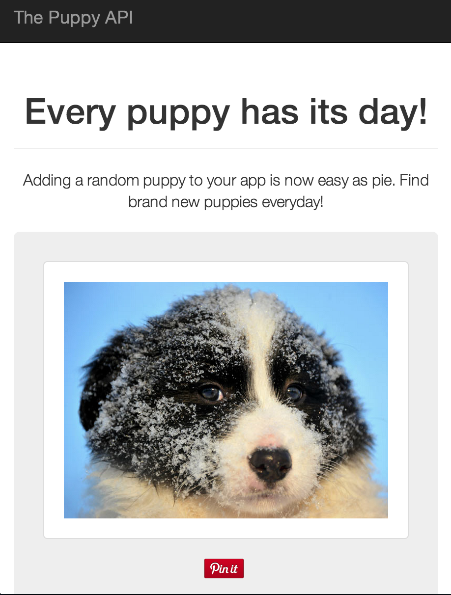

The Puppy API: Fun experiment with Go
-------------------------------------

An API that makes it super easy to add a random puppy image to your app!
Check out http://thepuppyapi.com

Found some nifty snippets that really helped piece this together...

### Google Custom Search API ###
https://code.google.com/p/google-api-go-client/
https://code.google.com/p/google-api-go-client/source/browse/googleapi/transport/
https://code.google.com/p/google-api-go-client/source/browse/customsearch/v1/

### Postgres Go Driver ###
Was looking for an ORM, but figured I'd give this a shot
http://godoc.org/github.com/lib/pq

### Getting started with Go on Heroku ###
http://mmcgrana.github.io/2012/09/getting-started-with-go-on-heroku.html

### Screenshot ###
